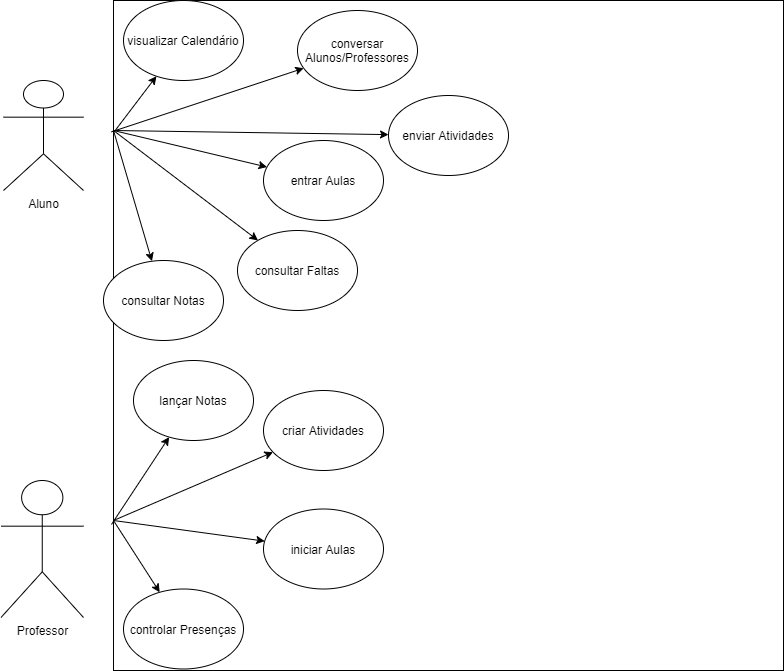
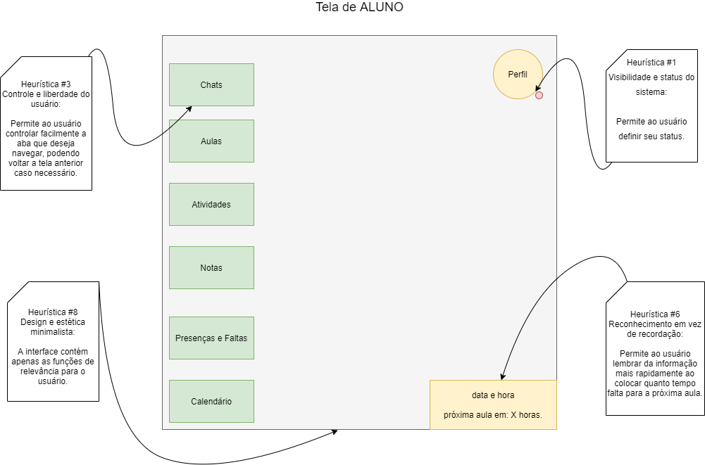
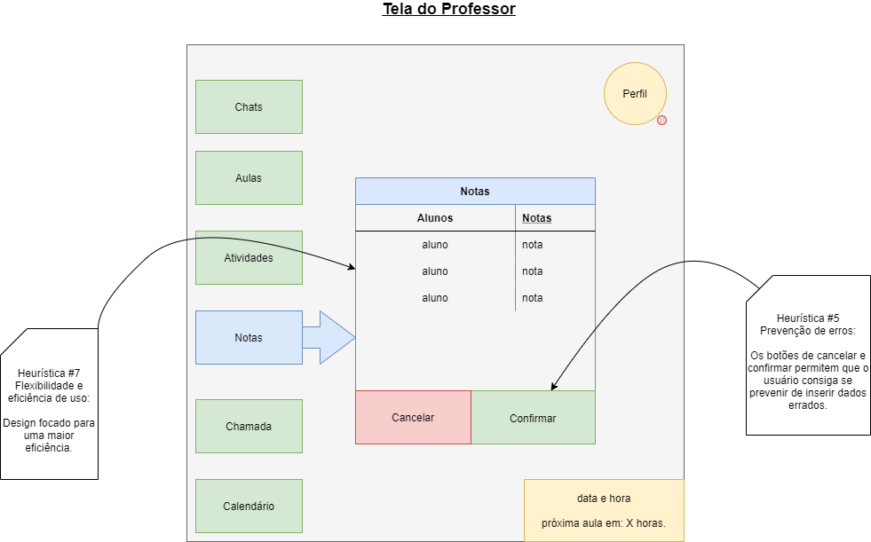
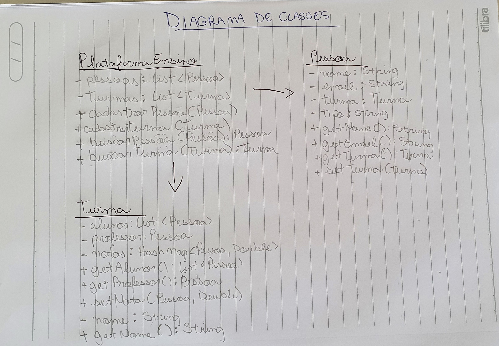
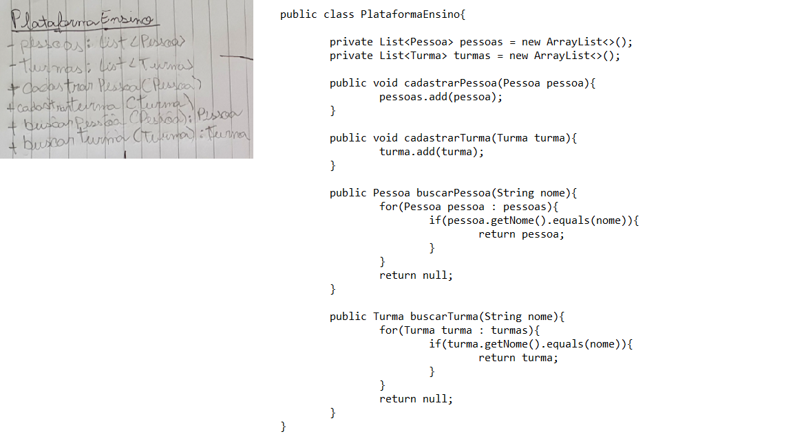
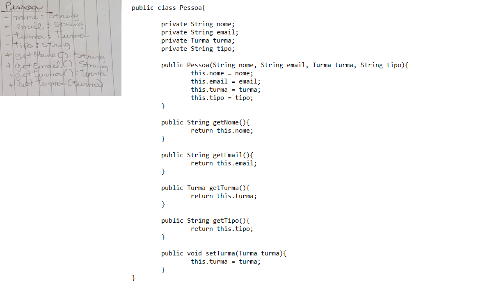
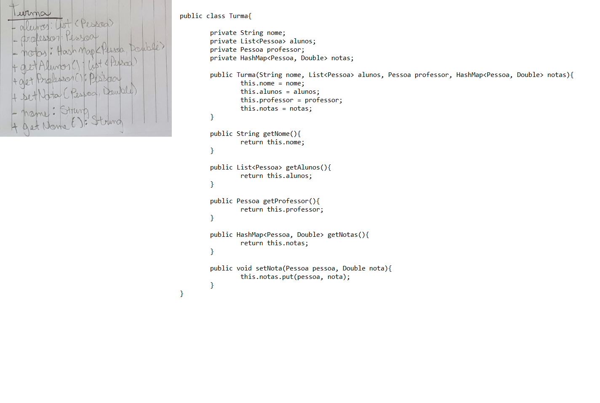

<h1 align=center> Thales Wilson de Lucca Kerber - 1460482121005</h1>

<h1>Ciclo de Vida de Desenvolvimento de Software
                        (Plataforma de Ensino)</h1>

<h2>Atividade de Análise de Requisitos(03/03/2022)</h2>

<h2>- Diagrama de caso (requisito funcional): </h2>

  
  
<h2>- Usabilidade (requisito não funcional): </h2>

  
  

<h2>Atividade de Projeto de Sistema (10/03/2022)</h2>

<h2>- Diagrama de classes: </h2>

  

<h2>Desenvolvimento de Sistema (11/03/2022)</h2>

<h2>- Classe "PlataformaEnsino": </h2>

  
  
<h2>- Classe "Aluno": </h2>

  
    
<h2>- Classe "Turma": </h2>

  
