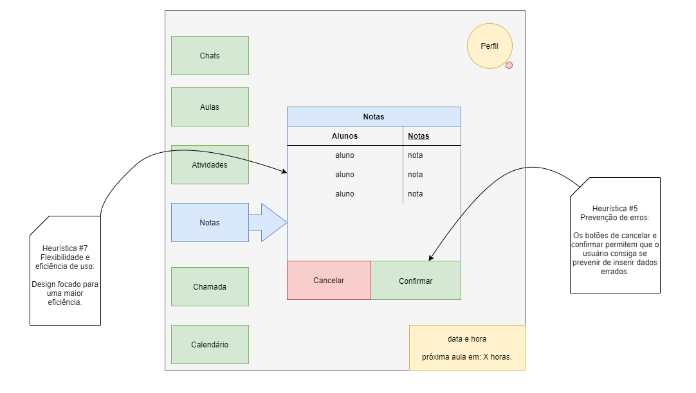

<h1 align=center> Thales Wilson de Lucca Kerber - 1460482121005</h1>

# Ciclo de Vida de Desenvolvimento de Software (Plataforma de Ensino)

## 📓 Atividade de Análise de Requisitos (03/03/2022)

> Diagrama de caso (requisito funcional):

  
  
> Usabilidade (requisito não funcional): 
 
### Tela Aluno
  
  
### Tela Professor
  

## 💻 Atividade de Projeto de Sistema (10/03/2022)

> Diagrama de classes:

  

## 🖥 Desenvolvimento de Sistema (11/03/2022):


> Classe "PlataformaEnsino":


  
  
  ```JAVA
  package plataformaensino;

import java.util.ArrayList;
import java.util.List;

public class PlataformaEnsino {

	private List<Pessoa> pessoas = new ArrayList<>();
	private List<Turma> turmas = new ArrayList<>();
	
	public void cadastrarPessoa(Pessoa pessoa) {
		pessoas.add(pessoa);
	}
	
	public void cadastrarTurma(Turma turma) {
		turmas.add(turma);
	}
	
	public Pessoa buscarPessoa(String nome) {
		Pessoa pessoa = null;
		
		for(Pessoa p : pessoas) {
			if(p.getNome().equalsIgnoreCase(nome)) {
				pessoa = p;
			}
		}
		
		return pessoa;
	}
	
	public Turma buscarTurma(int semestre) {
		Turma turma = null;
		
		for(Turma t : turmas) {
			if(t.getSemestre() == semestre) {
				turma = t;
			}
		}
		
		return turma;
	}
} 
  ```
  
> Classe "Pessoa":

  
  
   ```JAVA
package plataformaensino;

public class Pessoa {

	private String nome;
	private String email;
	private Turma turma;
	private String tipo;
	
	public Pessoa(String nome, String email, Turma turma, String tipo) {
		this.nome = nome;
		this.email = email;
		this.turma = turma;
		this.tipo = tipo;
	}
	
	public String getEmail() {
		return email;
	}
	
	public String getNome() {
		return nome;
	}
	
	public String getTipo() {
		return tipo;
	}
	
	public Turma getTurma() {
		return turma;
	}
	
	public void setTurma(Turma turma) {
		this.turma = turma;
	}
}

   ```
    
> Classe "Turma":

  
  
   ```JAVA
package plataformaensino;

public class Turma {

	private Pessoa professor;
	private int semestre;
	
	public Turma(Pessoa pessoa, int semestre) {
		this.professor = pessoa;
		this.semestre = semestre;
	}
	
	public Pessoa getProfessor() {
		return professor;
	}
	
	public int getSemestre() {
		return semestre;
	}
	
	public void setProfessor(Pessoa professor) {
		this.professor = professor;
	}
}

   ```

## Códigos API

> Códigos disponíveis em: [API](https://github.com/thaleskerber/bertoti/blob/main/engenharia%20de%20software%201/api.md)
