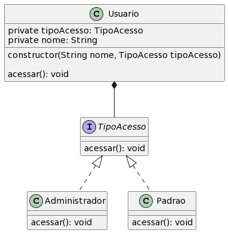

<h2 align=center>Padrão Estratégia (13/02/23)</h2>


<h4>. Diagrama UML</h4>
<br />
<div align="center">
  
</div>

<br />
<br />
<br />

<h4>. Implementação em Java</h4>
<br />
<br />

Classe Main
```java
public class Main {

  public static void main(String[] args) {
    Administrador administrador = new Administrador();
  
    Usuario acesso = new Usuario("João", administrador);
    acesso.acessar();
  }
}
```

Classe Usuario
```java
public class Usuario {
  private TipoAcesso tipoAcesso;
  private String nome;
  
  public Usuario(String nome, TipoAcesso tipoAcesso){
    this.tipoAcesso = tipoAcesso;
    this.nome = nome;
  }
  
  public void acessar(){
    this.tipoAcesso.acessar();
  }
}
```

Interface TipoAcesso
```java
public interface TipoAcesso {

  public void acessar();
  
}
```

Classe Administrador
```java
public class Administrador implements TipoAcesso {
  public void acessar(){
    System.out.print("Acessado como um administrador!");
  }
}
```

Classe Padrao
```java
public class Padrao implements TipoAcesso {
  public void acessar(){
    System.out.print("Acessado com o tipo padrão!");
  }
}
```
