<h1 align=center> Davi Elias Silvestre - 1460482121017</h1>

<h1 align="">Avaliação Heurística | IHC (Interação Humano Computador) | 3º Semestre ADS</h1>

<h2>Sumário</h2>

<h3>1. <a href="#1.perceptivel"> Perceptível</a></h3> 
<ul>
  <li>1.1<a href="#1.1_alternativas_de_texto"> Alternativas de texto </a></li>
  <li>1.2<a href="#1.2_midia_baseada_em_tempo"> Mídia baseada em tempo </a></li>
  <li>1.3<a href="#1.3_adaptavel"> Adaptável </a></li>
  <li>1.4<a href="#1.4_distinguivel"> Distinguível </a></li>
</ul>

<h3>2. <a href="#2.operavel"> Operável </a></h3>
<ul>
  <li>2.1<a href="#2.1_teclado_acessivel"> Teclado acessível </a></li>
  <li>2.2<a href="#2.2_tempo_suficiente"> Tempo suficiente </a></li>
  <li>2.3<a href="#2.3_convulsoes_e_reacoes_fisicas"> Convulsões e reações fisícas </a></li>
  <li>2.4<a href="#2.4_navegavel"> Navegável </a></li>
</ul>

<h3>3. <a href="#3.compreensivel"> Compreensível </a></h3>
<ul>
  <li>3.1<a href="#3.1_legivel"> Legível </a></li>
  <li>3.2<a href="#3.2_previsivel"> Previsível </a></li>
  <li>3.3<a href="#3.3_assistencia_de_entrada"> Assistência de entrada </a></li>
</ul>

<h3>4. <a href="#4.robusto"> Robusto </a></h3>
<ul>
  <li>4.1<a href="#4.1_compativel"> Compatível </a></li>
</ul>

#

<h2 id="1.perceptivel">1. Perceptível</h2>

<h3 id="1.1_alternativas_de_texto">1.1 Alternativas de Texto</h3>
Forneça alternativas de texto para qualquer conteúdo que não seja de texto para que possa ser alterado para outras formas que as pessoas precisem, como letras grandes, braille, fala, símbolos ou linguagem mais simples.

Exemplo de USO:

  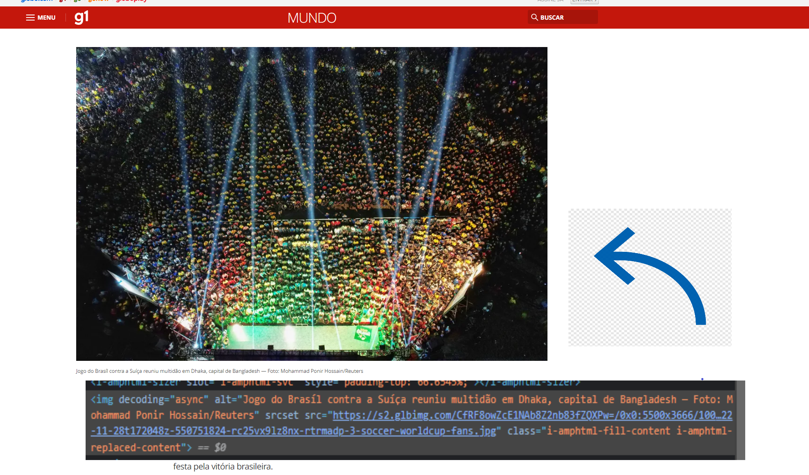
   
  <h4>Imagem com a tag ALT definida, encontrada em uma matéria recente no G1.</h4>

Exemplo de NÃO USO:

  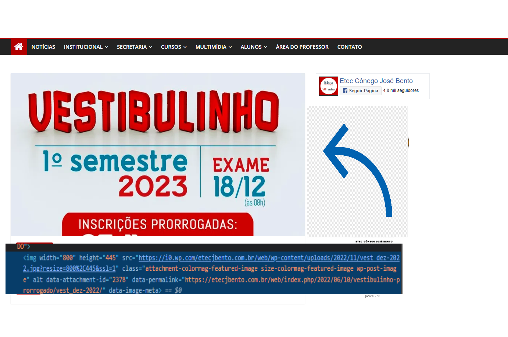
   
  <h4>Imagem sem a tag ALT definida, encontrada no site da Etec de Jacaréi</h4>

 

<h3 id="1.2_midia_baseada_em_tempo">1.2 Mídia Baseada em Tempo</h3>

Forneça alternativas para mídia baseada em tempo.

Exemplo COM legenda pré-gravada:

  
   
  <h4>Vídeo com legendas geradas automaticamente no youtube.</h4>

 

<h3 id="1.3_adaptavel">1.3 Adaptável</h3>
Garanta que o conteúdo possa ser apresentado em diferentes layouts sem perder informações ou estrutura. O conteúdo da página não se restringe a somente uma forma de exibição (como paisagem ou retrato), a menos que uma orientação de exibição seja específica seja definida previamente. 

Exemplo de site adaptável (responsivo):

  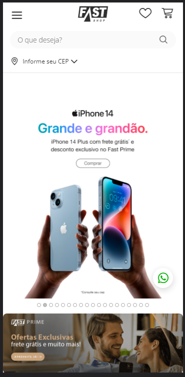
   
  <h4>Site construído de forma responsiva, onde o conteúdo se manteve com boa apresentação tanto em desktop quanto em celulares, exemplo encontrado no site da loja Fast Shop.</h4>

Exemplo de NÃO responsividade:

  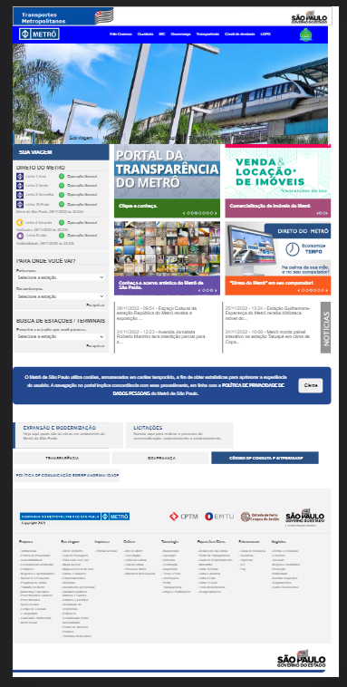
   
  <h4>Página sem responsividade para dispositivos móveis, encontrada no site da CPTM do Governo do Estado de São Paulo.</h4>

 

<h3 id="1.4_distinguivel">1.4 Distinguível</h3>
Faça com que seja simples para o seu usuário ver e ouvir o conteúdo, incluindo a distinção do primeiro plano do plano de fundo.

Exemplo de site distinguível:

  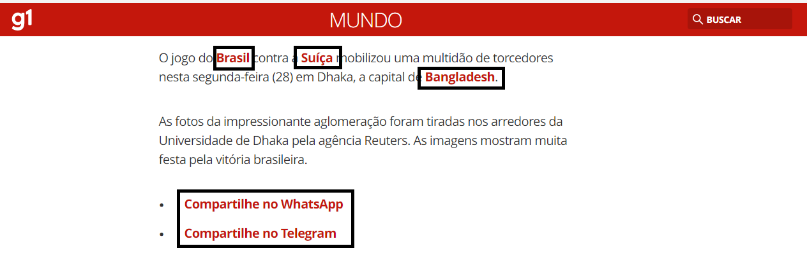
   
  <h4>Página em que palavras de destaque são distinguíveis, exemplo encontrado em uma matéria do G1.</h4>

Exemplo de NÃO distinguível:

  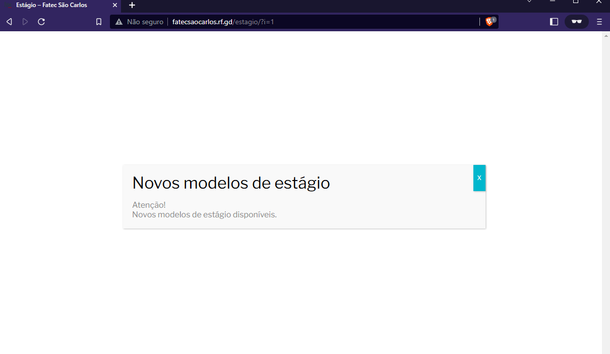
   
  <h4>Na página de Estágios da Fatec São Carlos há um baixo contraste entre a cor de fundo e a cor do aviso.</h4>

 

<h2 id="2.operavel">2. Operável</h2>

<h3 id="2.1_teclado_acessivel">2.1 Teclado Acessível</h3>  
Todas as funcionalidades devem ser interativas a partir de um teclado.

Exemplo de uso de teclas de atalho no twitter:

  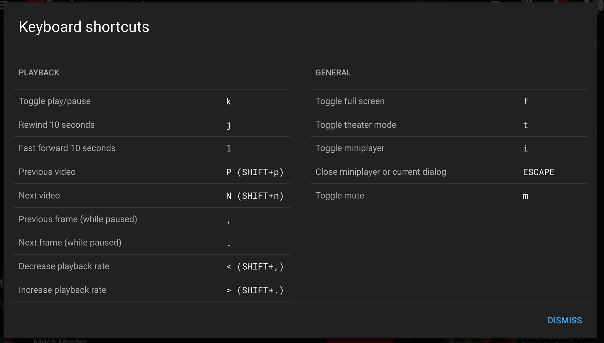
   
  <h4>No Youtube existem teclas de atalho para facilitar o usuário a interagir com o vídeo que está sendo reproduzido.</h4>

 

<h3 id="2.2_tempo_suficiente">2.2 Tempo Suficiente</h3>
Permita que os conteúdos a serem exibidos permaneçam na tela por tempo suficiente para que possam ser lidos.

Exemplo de uso em vídeos do youtube:

  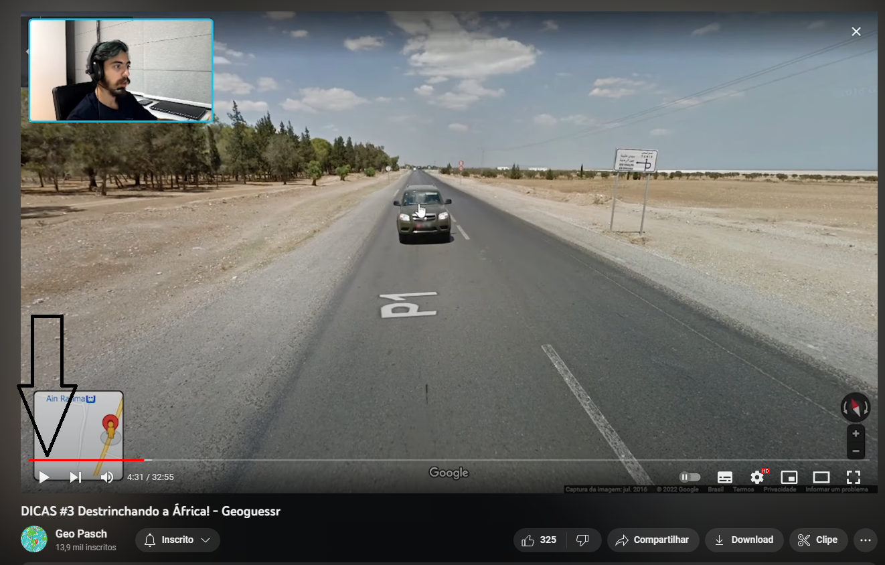
   
  <h4>No Youtube existe um botão para que você possa pausar ou voltar/avançar o vídeo que está sendo reproduzido.</h4>

 

<h3 id="2.4_navegavel">2.4 Navegável</h3>
Forneça maneiras de ajudar o usuário a navegar, encontrar conteúdo e determinar os passos seguintes para chegar ao seu objetivo.

Exemplo de formulário navegável:

    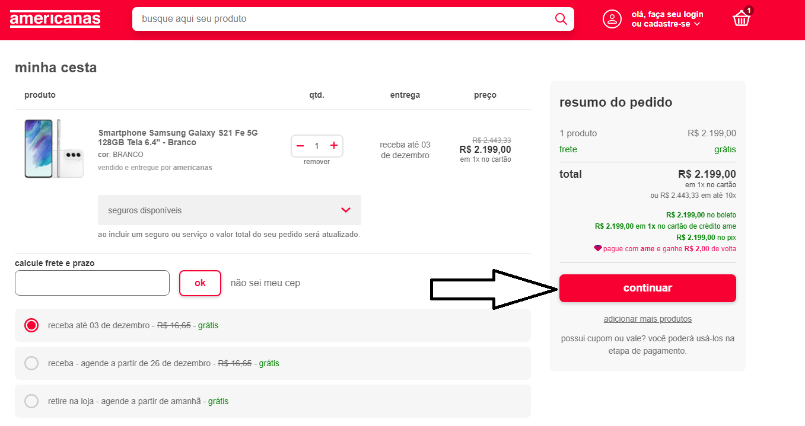
   
  <h4>No site da Americanas ao acessar seu carrinho de compras existe uma sequência bem clara para prosseguir com a compra.</h4>

 

<h2 id="3.compreensivel">3. Compreensível</h2>

<h3 id="3.1_legivel">3.1 Legível</h3>
A linguagem humana padrão de cada página da Web pode ser determinada programaticamente.

Exemplo de USO:

  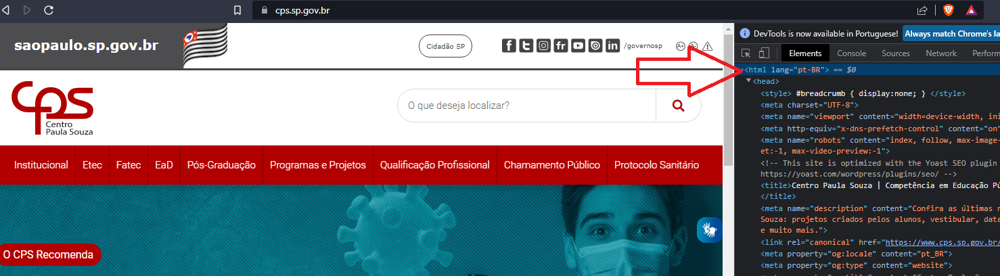
   
  <h4>No site do Centro Paula Souza a linguagem humana foi determinada na tag html da página.</h4>

Exemplo de NÃO USO:

  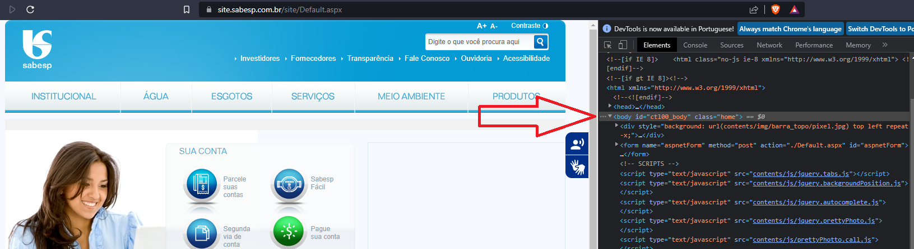
   
  <h4>No site da Sabesp não foi definida uma linguagem humana na estrutura da página.</h4>

 

<h3 id="3.2_previsivel">3.2 Previsível</h3>
Páginas da Web, aplicativos e interfaces online devem ser intuitivos e previsíveis em como funcionam. Os sites geralmente têm uma estrutura definida. Isso ajuda as pessoas a encontrar facilmente informações desejadas.

Exemplo de USO:

  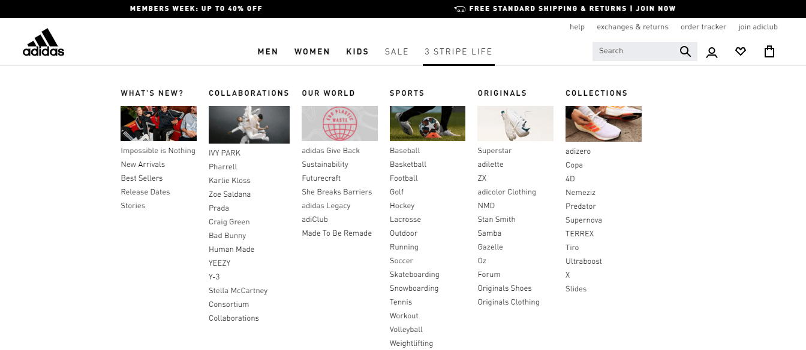
   
  <h4>No site da Adidas percebe-se que as opções do menu estão divididas de forma com que o usuário consiga navegar e encontrar o que procura intuitivamente.</h4>

 

<h3 id="3.3_assistencia_de_entrada">3.3 Assistência de Entrada</h3>
Ajude o usuário a evitar, buscar e corrigir os erros.

Exemplo:

  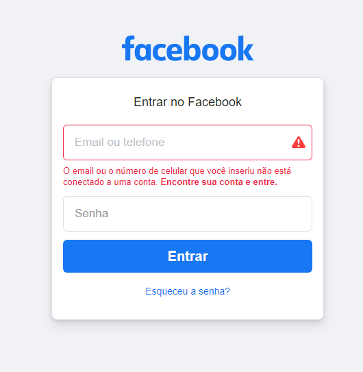
   
  <h4>No site do Facebook existe uma validação no login ajudando o usuário a encontrar onde ele falhou ao preencher o formulário.</h4>

 

<h2 id="4.robusto">4. Robusto</h2>
O conteúdo deve ser robusto o suficiente para que possa ser interpretado por uma ampla variedade de agentes de usuário, incluindo tecnologias assistivas.

<h3 id="4.1_compativel">4.1 Compatível</h3>
No conteúdo implementado usando linguagens de marcação, as mensagens de status podem ser determinadas programáticamente por meio de função ou propriedades, de modo que possam ser apresentadas ao usuário por tecnologias assistivas sem receber foco.

Exemplo:

  
   
  <h4>No Discord é possível definir uma mensagem de status que é facilmente entendida por outros usuários por possuir cores e símbolos que representam o status de disponibilidade do usuário.</h4>

