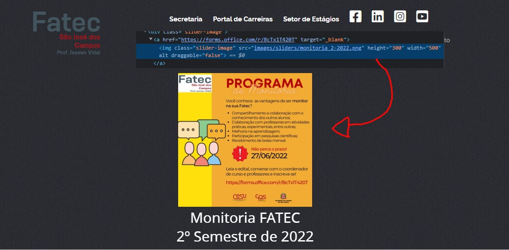
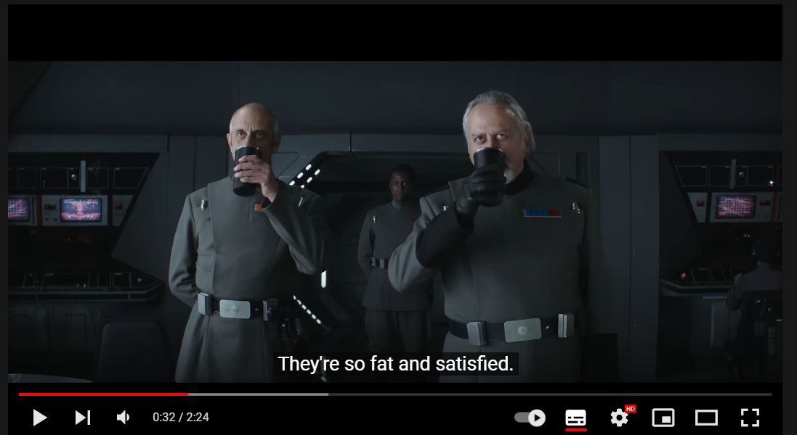
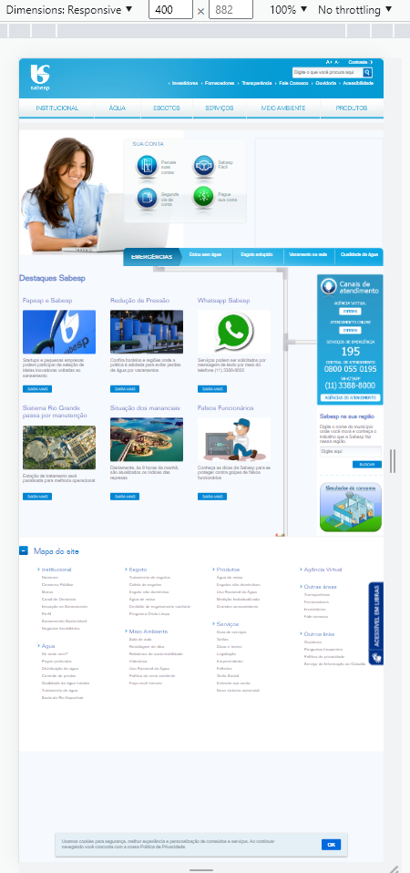
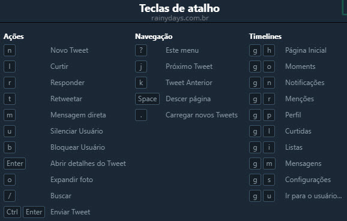
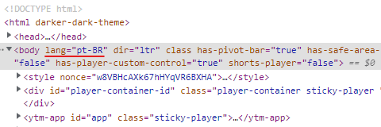
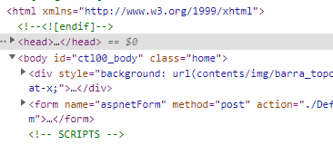
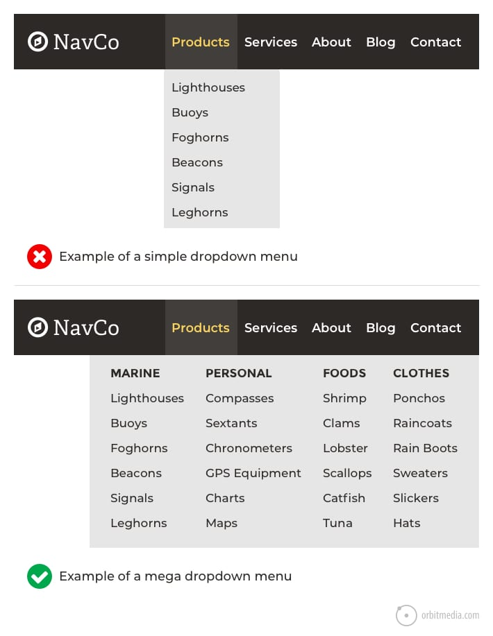
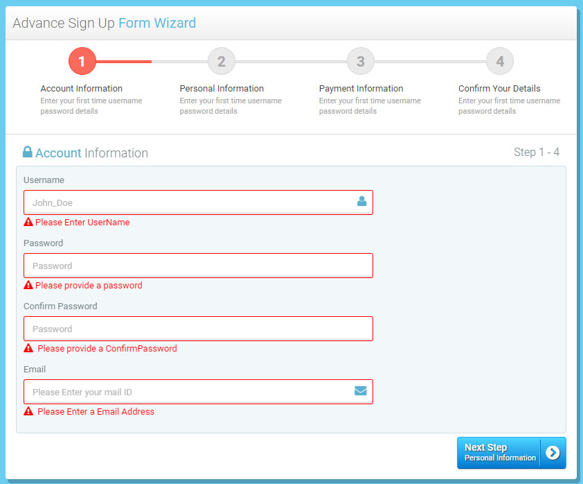

<h1 align=center> Thales Wilson de Lucca Kerber - 1460482121005</h1>

<h1 align="">Avaliação Heurística | IHC (Interação Humano Computador) | 3º Semestre ADS</h1>

<h2>Sumário</h2>

<h3>1. <a href="#1.perceptivel"> Perceptível</a></h3> 
<ul>
  <li>1.1<a href="#1.1_alternativas_de_texto"> Alternativas de texto </a></li>
  <li>1.2<a href="#1.2_midia_baseada_em_tempo"> Mídia baseada em tempo </a></li>
  <li>1.3<a href="#1.3_adaptavel"> Adptável </a></li>
  <li>1.4<a href="#1.4_distinguivel"> Distinguível </a></li>
</ul>

<h3>2. <a href="#2.operavel"> Operável </a></h3>
<ul>
  <li>2.1<a href="#2.1_teclado_acessivel"> Teclado acessível </a></li>
  <li>2.2<a href="#2.2_tempo_suficiente"> Tempo suficiente </a></li>
  <li>2.3<a href="#2.3_convulsoes_e_reacoes_fisicas"> Convulsões e reações fisícas </a></li>
  <li>2.4<a href="#2.4_navegavel"> Navegável </a></li>
  <!-- <li>2.5<a href="#2.5_modalidades_de_entrada"> Modalidades de entrada </a></li> -->
</ul>

<h3>3. <a href="#3.compreensivel"> Compreensível </a></h3>
<ul>
  <li>3.1<a href="#3.1_legivel"> Legível </a></li>
  <li>3.2<a href="#3.2_previsivel"> Previsível </a></li>
  <li>3.3<a href="#3.3_assistencia_de_entrada"> Assistência de entrada </a></li>
</ul>

<h3>4. <a href="#4.robusto"> Robusto </a></h3>
<ul>
  <li>4.1<a href="#4.1_compativel"> Compatível </a></li>
</ul>

#

<h2 id="1.perceptivel">1. Perceptível</h2>

<h3 id="1.1_alternativas_de_texto">1.1 Alternativas de Texto</h3>
Forneça alternativas de texto para qualquer conteúdo que não seja de texto para que possa ser alterado para outras formas que as pessoas precisem, como letras grandes, braille, fala, símbolos ou linguagem mais simples.

Exemplo de USO:

``

  

Exemplo de NÃO USO:

  
   
  <h4>Imagem sem a tag ALT definida, encontrada no site da Fatec São José dos Campos</h4>

 

<h3 id="1.2_midia_baseada_em_tempo">1.2 Mídia Baseada em Tempo</h3>

Forneça alternativas para mídia baseada em tempo.

Exemplo COM legenda pré-gravada:

  

Exemplo de NÃO USO:

  
   
  <h4>Vídeo sem legenda, encontrado no feed do Instagram</h4>

 

<h3 id="1.3_adaptavel">1.3 Adaptável</h3>
Garanta que o conteúdo possa ser apresentado em diferentes layouts sem perder informações ou estrutura. O conteúdo da página não se restringe a somente uma forma de exibição (como paisagem ou retrato), a menos que uma orientação de exibição seja específica seja definida previamente. 

Exemplo de site adaptável (responsivo):

  

Exemplo de NÃO responsividade:

  
   
  <h4>Página sem responsividade para dispositivos móveis, encontrada no site da Sabesp.</h4>

 

<h3 id="1.4_distinguivel">1.4 Distinguível</h3>
Faça com que seja simples para o seu usuário ver e ouvir o conteúdo, incluindo a distinção do primeiro plano do plano de fundo.

Exemplo de site distinguível:

  

Exemplo de NÃO distinguível:

  
   
  <h4>Nessa parte da página home percebe-se que o branco do notebook da imagem não se distingue do fundo branco da página, encontrada no site da Sabesp.</h4>

 

<h2 id="2.operavel">2. Operável</h2>

<h3 id="2.1_teclado_acessivel">2.1 Teclado Acessível</h3>  
Todas as funcionalidades devem ser interativas a partir de um teclado.

Exemplo de uso de teclas de atalho no twitter:

  

 

<h3 id="2.2_tempo_suficiente">2.2 Tempo Suficiente</h3>
Permita que os conteúdos a serem exibidos permaneçam na tela por tempo suficiente para que possam ser lidos.

Exemplo de uso em vídeos do youtube:

  

 

<h3 id="2.3_convulsoes_e_reacoes_fisicas">2.3 Convulsões e Reações Fisícas</h3>
A epilepsia fotossensível é uma condição em que as convulsões são desencadeadas por luzes intermitentes ou padrões contrastantes de luz e escuridão. Tendo em mente essa condição o uso de luzes e super-estímulos vizuais devem ser evitados, caso não seja posível devemos aletar o usuário antes que ele seja exposto a esse típo de conteúdo.

<h3 id="2.4_navegavel">2.4 Navegável</h3>
Forneça maneiras de ajudar o usuário a navegar, encontrar conteúdo e determinar os passos seguintes para chegar ao seu objetivo.

Exemplo de formulário navegável:

    

 

<!-- <h3 id="2.5_modalidades_de_entrada">2.5 Modalidades de entrada</h3> -->

<h2 id="3.compreensivel">3. Compreensível</h2>

<h3 id="3.1_legivel">3.1 Legível</h3>
A linguagem humana padrão de cada página da Web pode ser determinada programaticamente.

Exemplo de USO:

  

Exemplo de NÃO USO:

  

 

<h3 id="3.2_previsivel">3.2 Previsível</h3>
Páginas da Web, aplicativos e interfaces online devem ser intuitivos e previsíveis em como funcionam. Os sites geralmente têm uma estrutura definida. Isso ajuda as pessoas a encontrar facilmente informações desejadas.

Exemplo de USO e NÃO USO:

  

 

<h3 id="3.3_assistencia_de_entrada">3.3 Assistência de Entrada</h3>
Ajude o usuário a evitar, buscar e corrigir os erros.

Exemplo:

  

 

<h2 id="4.robusto">4. Robusto</h2>
O conteúdo deve ser robusto o suficiente para que possa ser interpretado por uma ampla variedade de agentes de usuário, incluindo tecnologias assistivas.

<h3 id="4.1_compativel">4.1 Compatível</h3>
No conteúdo implementado usando linguagens de marcação, as mensagens de status podem ser determinadas programáticamente por meio de função ou propriedades, de modo que possam ser apresentadas ao usuário por tecnologias assistivas sem receber foco.

Exemplo:

  

